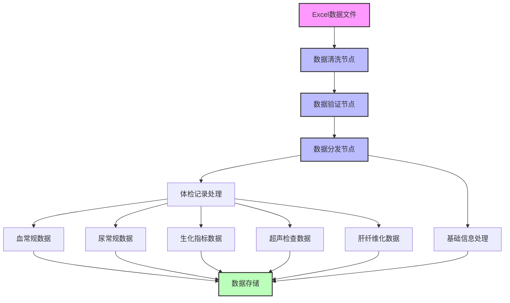
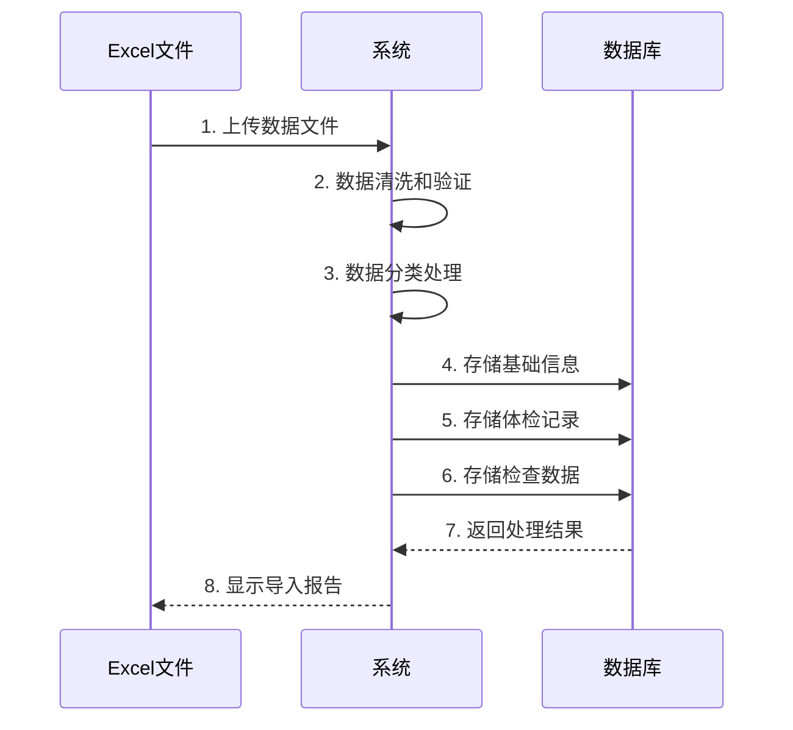
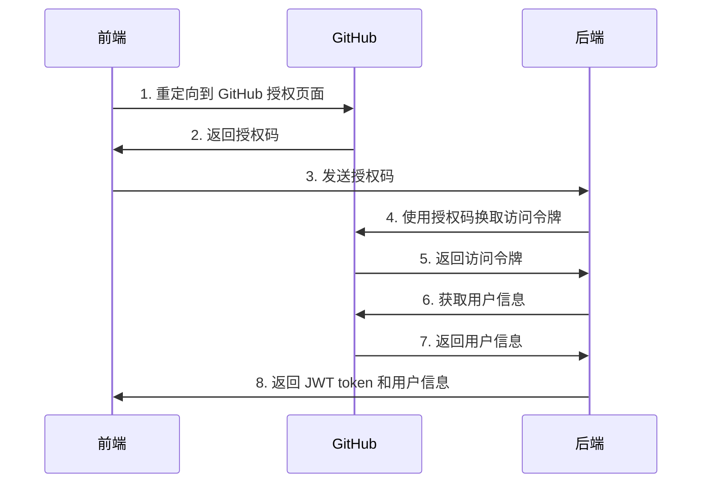

# 2023210405015软工231王科然

### 项目说明
 本项目根据课程要求开发，采用管理员视角进行系统设计，已实现核心功能模块的完整开发，包括数据导入、存储、查询和分析等。各模块独立封装，便于后期的维护与升级 。

### 技术架构
系统采用前后端分离的微服务架构：
- **前端技术栈**：Vue.js + Element UI
- **后端技术栈**：Python + Flask + MySQL
- **认证方案**：GitHub OAuth2.0 + JWT

代码仓库：[wangKeRann/Monday](https://github.com/wangKeRann/Monday)

### 项目文件结构
```
├── frontend/                # 前端项目目录
│   ├── src/                # Vue源代码
│   ├── public/            # 静态资源
│   ├── server/            # 前端服务器配置
│   ├── package.json       # 项目依赖配置
│   └── vue.config.js      # Vue配置文件
│
├── backend/               # 后端项目目录
│   ├── main.py           # 主程序入口
│   ├── api.py            # API接口定义
│   ├── auth.py           # 认证相关
│   ├── models.py         # 数据模型
│   ├── config.py         # 配置文件
│   ├── analysise.py      # 数据分析模块
│   ├── detail.py         # 详细信息处理
│   ├── import_data.py    # 数据导入模块
│   ├── check_record.py   # 记录检查模块
│   ├── countMember.py    # 成员统计模块
│   ├── getKeyPoint.py    # 关键点提取
│   ├── github.py         # GitHub集成
│   ├── test_db.py        # 数据库测试
│   ├── check_tables.py   # 表结构检查
│   ├── last.py           # 最新数据处理
│   ├── app.db            # MySQL数据库
│   └── requirements.txt  # Python依赖
│
├── import_data.py        # 数据导入脚本
└── README.md            # 项目说明文档
```

### 核心功能模块

1. **数据导入与存储**
   - 支持Excel数据导入
   - 数据清洗和验证
   - 分类存储各类检查数据



### 数据导入流程说明

#### 1. 数据预处理阶段
- **数据读取节点**：从Excel文件读取原始数据
- **数据清洗节点**：处理异常值和缺失值
- **数据验证节点**：验证数据格式和完整性
- **数据分发节点**：将数据分发到不同的处理流程

#### 2. 数据处理阶段
- **基础信息处理**：
  - 提取体检者基本信息
  - 标准化日期格式
  - 处理性别和年龄信息

- **体检记录处理**：
  - 生成唯一记录ID（后续查找的关键）
  - 关联基础信息
  - 分发到各类检查数据处理

#### 3. 检查数据处理（按照第一周数据清洗的结果进行划分，这里不再概述）
- **血常规数据**：
  
- **尿常规数据**：
  
- **生化指标数据**：
  
- **超声检查数据**：
  
- **肝纤维化数据**：

#### 4. 数据存储阶段
### 数据导入特点

1. **有向无环图(DAG)结构**
   - 数据流向清晰
   - 避免循环依赖
   - 便于并行处理

2. **模块化设计**
   - 各处理节点独立
   - 易于扩展和维护
   - 支持新检查类型添加


### 数据导入流程示例



### 数据清洗问题及解决方案

#### 1. 空值和NAT值处理
在数据导入过程中，我们发现数据中存在大量的空值（NULL）和NAT（Not A Time）值。这些值通常出现在以下情况：
- 体检者未进行某些检查项目
- 数据录入过程中的遗漏
- 系统导出数据时的格式问题

经过分析，我们采取了以下处理方案：
1. **直接删除策略**：
   - 对于完全缺失的检查项目记录
   - 对于无法通过其他数据推断的NAT值
   - 对于明显无效的数据条目

2. **处理依据**：
   - 这些空值和NAT值无法提供有效的分析信息
   - 保留这些数据可能会影响后续的统计分析
   - 删除这些数据不会影响整体数据的完整性

3. **处理效果**：
   - 提高了数据质量
   
   - 减少了异常值对分析的影响
   
   - 提升了系统处理效率
   
### 存在的问题

#### 1. 数据查询问题
- 在查询特定类别数据时，后端返回NULL值
- 可能原因：数据表设计存在缺陷
- 解决方案：计划在第三周进行数据表结构优化

#### 2. 系统架构问题
- 前后端耦合度较高
- 数据验证逻辑分散
- 需要进一步模块化设计

#### 3. 性能问题
- 大数据量查询响应慢（前端目前采用懒加载的方式来优化显示）
- 数据缓存机制不完善
- 需要优化查询算法

### 改进计划
1. 近期优化
   - 重构数据表结构
   - 完善数据验证
   - 优化查询性能

2. 中期规划
   - 实现数据缓存
   - 优化系统架构
   - 提升响应速度

## 功能实现

### 1. OAUTH2 用户登录模块

#### 1.1 登录流程
## 登录流程



## 数据查询模块

### 一：按时间轴查看历史体检报告

### 1. 功能概述

本模块实现了基于时间轴的体检报告查询功能，主要包含以下特点：
- 支持按时间范围查询历史体检记录
- 提供记录的基本信息展示（日期、性别、年龄、记录ID）
- 支持通过记录ID快速查看详细报告内容

### 2. 功能特点

#### 2.1 时间范围查询
- 支持灵活的时间范围选择（比如最近一年）
- 按日期降序排列，方便查看最新记录
- 自动格式化日期显示

## 二：关键指标快速检索功能

### 1. 功能概述
本模块实现了对体检数据的快速检索功能，支持五大类体检指标的查询：
- 血常规检查
- 尿常规检查
- 生化指标检查
- 超声检查
- 肝纤维化检查

### 2. 数据库设计
系统为每类检查创建了独立的数据表：
- `blood_routine`: 血常规数据表
- `urine_routine`: 尿常规数据表
- `biochemistry`: 生化指标表
- `ultrasound`: 超声检查表
- `liver_fibrosis`: 肝纤维化数据表

## 三：报告详情页功能

### 1. 功能概述
本模块实现了通过记录ID查询用户详细体检报告的功能，支持查看完整的体检数据和参考指标，并提供外部医疗建议链接。

### 2. 功能实现

#### 2.1 参考数据

系统为每个指标设置了标准参考范围（点击链接可以跳转至外部科普链接），例如：

- 血常规：
  - 白细胞计数：4.0-10.0
  - 红细胞计数：3.5-5.5
  - 血小板计数：100-300 

#### 2.2 查询界面
- 提供记录ID输入框
- 支持快速查询按钮
- 显示查询结果加载状态

#### 2.3 异常指标高亮标记
- 实现方式：通过前端CSS样式实现
- 判断逻辑：
  - 当检测值超出参考范围时自动高亮显示
  - 高于参考范围上限显示红色
  - 低于参考范围下限显示蓝色
- 样式实现：
```css
/* 异常值样式 */
.abnormal-high {
    color: #ff4d4f;
    font-weight: bold;
    background-color: #fff1f0;
}

.abnormal-low {
    color: #1890ff;
    font-weight: bold;
    background-color: #e6f7ff;
}

/* 正常值样式 */
.normal {
    color: #52c41a;
}
```
- 判断函数：
```javascript
function getValueClass(value, key) {
    const range = referenceRanges[key];
    if (!range) return 'normal';
    
    if (value > range.max) return 'abnormal-high';
    if (value < range.min) return 'abnormal-low';
    return 'normal';
}
```

# 统计分析模块

## 一：指标趋势分析功能

### 1. 功能概述
本模块实现了对特定指标在选定时间范围内的趋势分析，通过图表直观展示指标变化情况。

### 2. 功能实现

#### 2.1 查询条件
- 时间范围选择
  - 开始日期
  - 结束日期
- 指标类型选择
  - 血常规指标
  - 尿常规指标
  - 生化指标
  - 肝纤维化指标
- 具体指标选择
  - 根据指标类型动态加载具体指标选项

#### 2.2 数据展示
- 趋势图表展示
  - 使用ECharts实现折线图
  - 显示指标变化趋势

## 体检数据对比功能

### 1. 功能概述
本模块实现了不同年龄段和性别的体检数据对比分析，通过柱状图直观展示男性和女性的异常记录数量对比。

### 2. 功能实现

#### 2.1 查询条件
- 年龄段选择
  - 支持自定义年龄段范围
  - 预设常用年龄段选项

#### 2.2 数据展示
- 对比图表展示
  - 使用柱状图展示男女对比
  - 显示各指标异常数量
  - 支持图表交互
  - 数据标签显示
- 统计信息
  - 各年龄段总人数
  - 异常率统计
  - 性别比例

### 4. 后续优化方向

#### 4.1 功能扩展
- 支持多维度对比
- 添加趋势分析
- 支持自定义对比维度
- 增加异常原因分析

#### 4.2 用户体验提升
- 优化图表交互
- 支持图表导出
- 添加数据筛选功能
- 优化移动端显示

#### 4.3 性能优化
- 实现数据缓存
- 优化查询性能
- 添加数据预加载
- 优化图表渲染

## 健康评分系统

### 1. 功能概述
本模块实现了基于体检数据的健康评分功能，采用百分制对用户健康状况进行评估。目前仅基于体检数据进行评分，存在数据完整性和实时性的问题。

### 2. 当前实现

#### 2.1 评分维度
- 体检数据（60%）
  - 血常规指标
  - 尿常规指标
  - 生化指标
  - 肝纤维化指标
- 生活习惯（30%）
  - 当前未实现
  - 需要补充数据采集
- 遗传因素（10%）
  - 当前未实现
  - 需要补充数据采集

#### 2.2 评分标准（已实现的）
- 体检指标评分
  - 根据参考范围判断
  - 异常值扣分
  - 严重异常加倍扣分
- 总分计算
  - 各指标加权平均
  - 考虑指标重要性
  - 设置最低分保障

### 3. 存在的问题

#### 3.1 数据完整性问题
- 缺少生活习惯数据
  - 需要设计数据采集方案
  - 考虑用户填写方式
  - 数据真实性验证
- 缺少遗传因素数据
  - 需要设计数据采集方案
  - 考虑数据隐私保护
  - 数据准确性验证

### 5. 后续开发计划

#### 5.1 近期计划
- 设计用户体系
- 开发数据采集接口
- 完善评分标准

#### 5.2 中期计划
- 实现数据实时更新
- 优化评分算法
- 增加数据可视化

#### 5.3 长期计划
- 建立完整健康档案
- 实现个性化评分
- 提供健康建议

## 异常人群排名与干预功能

### 1. 功能概述
本模块旨在实现异常人群的识别、排名和干预管理，通过风险预警机制对高风险人群进行及时干预。目前仅实现了基础的异常人数统计功能。

### 2. 当前实现

#### 2.1 异常统计
- 按年龄段统计
  - 显示各年龄段异常人数
  - 计算异常率
  - 性别分布对比
- 按指标类型统计
  - 血常规异常统计
  - 尿常规异常统计
  - 生化指标异常统计
  - 肝纤维化异常统计

#### 2.2 数据展示
- 统计图表
  - 柱状图展示异常分布
  - 饼图显示比例
  - 趋势图展示变化

### 3. 目标功能（待实现）

#### 3.1 风险预警系统
- 风险等级划分
  - 高风险（如BMI>28）
  - 中风险
  - 低风险
- 预警规则
  - 单项指标预警
  - 多指标组合预警
  - 动态阈值调整

#### 3.2 人群排名
- 区域排名
  - 按行政区划
  - 按医疗机构
  - 按人口密度
- 全国排名
  - 标准化评分
  - 相对排名
  - 趋势变化

#### 3.3 干预管理
- 干预方案
  - 个性化建议
  - 跟踪随访
  - 效果评估
- 干预记录
  - 干预措施
  - 执行情况
  - 效果反馈

### 4. 待实现功能

#### 4.1 数据采集
- 风险因素
  - 生活习惯
  - 家族史
  - 环境因素
- 干预数据
  - 干预措施
  - 执行记录
  - 效果评估

#### 4.2 排名系统
- 评分标准
  - 风险因素权重
  - 异常程度评分
  - 动态调整机制
- 数据更新
  - 实时更新
  - 定期统计
  - 历史对比

#### 4.3 干预系统
- 干预方案库
  - 标准方案
  - 个性化方案
  - 专家建议
- 跟踪系统
  - 执行监控
  - 效果评估
  - 方案调整

## 性能优化

### 1. 延时加载技术实现

#### 1.1 前端实现
- 使用 Element UI 的 Infinite Scroll 组件实现列表延时加载
```vue
<template>
  <div class="health-records">
    <el-table
      v-infinite-scroll="loadMore"
      :data="records"
      infinite-scroll-disabled="loading"
      infinite-scroll-distance="10">
      <el-table-column prop="date" label="日期"></el-table-column>
      <el-table-column prop="name" label="姓名"></el-table-column>
      <el-table-column prop="result" label="检查结果"></el-table-column>
    </el-table>
    <div v-if="loading" class="loading">加载中...</div>
  </div>
</template>

<script>
export default {
  data() {
    return {
      records: [],
      page: 1,
      pageSize: 20,
      loading: false
    }
  },
  methods: {
    async loadMore() {
      if (this.loading) return
      this.loading = true
      try {
        const response = await this.fetchRecords(this.page, this.pageSize)
        this.records = [...this.records, ...response.data]
        this.page++
      } finally {
        this.loading = false
      }
    }
  }
}
</script>
```
- 每次加载20条数据，滚动到底部自动加载更多
- 减少首屏加载时间，提升用户体验
